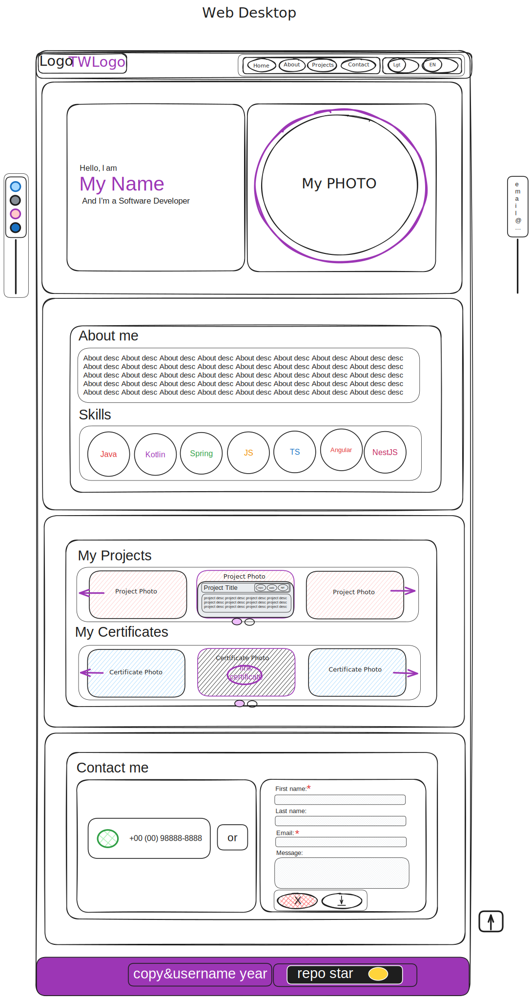
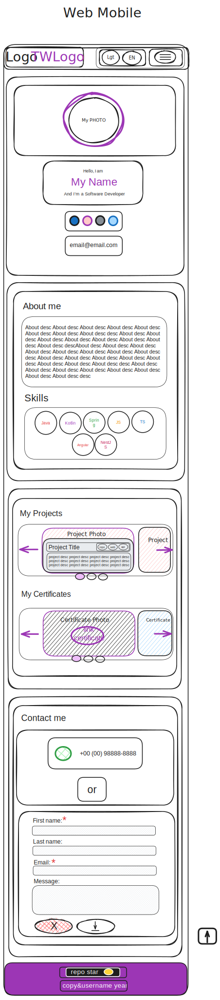
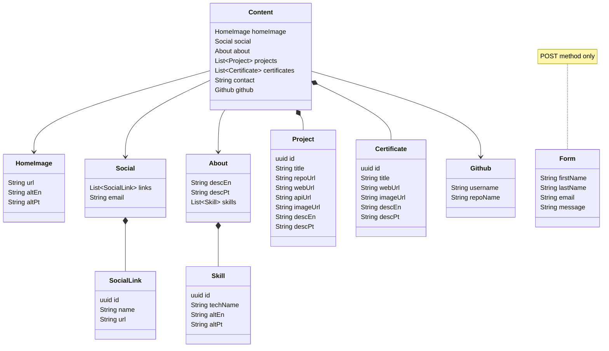

<h1 align="center">Portfolio</h1>

### Description

<p align="center justify">
This is the repository of my personal Portfolio, with the aim of making something that is not just a static portfolio,
but that can however be changed via the API.
</p>

## FRONTEND

<p align="center justify">
A SPA front-end made with the Angular framework version 16, chosen by best compatibility with the NGX-Translate translation library, following a small pre-defined component structure and Styled Components technique.
</p>

#### Tech Stack:

    Angular@16

#### Libraries:

    NGX-Translate, Swiper@8, AOS, Remix Icon, Flag-Icons, DEVICON, Github-Buttons

#### Color Reference:

- --primary-color-light:  #b421ce;
- --primary-color:  #8e24aa;
- --primary-color-dark:  #6a1b9a;
- --bkg-color: 
  #f5f5f5 |  #212121;
- --text-color: 
  #000 |  #fff;
- --btn-color:  --primary-color;
- --btn-text-color:  #fff; 
- --modal-color:  #FFFFFFBF |  #000000BF;

#### Components:

- [ ] AppComponent:
    - [ ] HeaderComponent:
        - [ ] Logo:
            - [ ] TipewriterComponent
        - [ ] Nav:
            - [ ] CheckButtonComponent
            - [ ] GlowButtonComponent
    - [ ] HomeComponent:
        - [ ] HeroText
        - [ ] HeroImage:
            - [ ] ProfileImageComponent
    - [ ] SocialComponent:
        - [ ] SocialLinks
        - [ ] SocialEmail
    - [ ] AboutComponent:
        - [ ] AboutDesc
        - [ ] SkillsIcons
    - [ ] ProjectsComponent:
        - [ ] SwipeContainer:
            - [ ] CardComponent
    - [ ] ContactComponent:
        - [ ] ContactInfo
        - [ ] FormComponent
    - [ ] ReturnButtonComponent
    - [ ] FooterComponent
        - [ ] Copyuser
        - [ ] GithubStarComponent

#### Images:

<p align="center">


</p>

## BACKEND

<p align="center justify">
This is an API developed in NestJS with two main endpoints: 'Page Content' (GET method only), 'Email Form' (POST method only) to feed the frontend and some other endpoints developed to populate the 'Page Content' main endpoint, in addition, 'Page Content' uses MongoDB as the main database and a memory cache. The 'Email Form' does not use a bank, it just sends the POST directly to the application's email via SMTP.
</p>

#### Tech Stack:

    NestJS@10, MongoDB Cloud

#### Libraries:

    Swagger, NodeMailer, TypeORM, Cache-Manager

#### Tables:



#### JSON:

```JSON
{
  "content": {
    "home_image": {
      "url": "",
      "alt_en": "",
      "alt_pt": ""
    },
    "social": {
      "links": [
        {
          "id": "uuid",
          "name": "",
          "url": ""
        }
      ],
      "email": ""
    },
    "about": {
      "desc_en": "",
      "desc_pt": "",
      "skills": [
        {
          "id": "uuid",
          "tech_name": "",
          "alt_en": "",
          "alt_pt": ""
        }
      ]
    },
    "projects": [
      {
        "id": "uuid",
        "title": "",
        "repo_url": "",
        "web_url": "",
        "api_url": "",
        "image_url": "",
        "desc_en": "",
        "desc_pt": ""
      }
    ],
    "certificates": [
      {
        "id": "uuid",
        "title": "",
        "web_url": "",
        "image_url": "",
        "desc_en": "",
        "desc_pt": ""
      }
    ],
    "contact": "",
    "github": {
      "username": "",
      "repo_name": ""
    }
  },
  "form": {
    "first_name": "",
    "last_name": "",
    "email": "",
    "message": ""
  }
}
```

## License

This project is [MIT](https://choosealicense.com/licenses/mit/) licensed.
